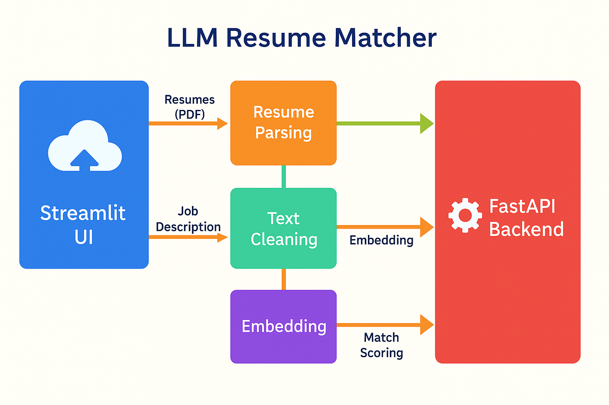
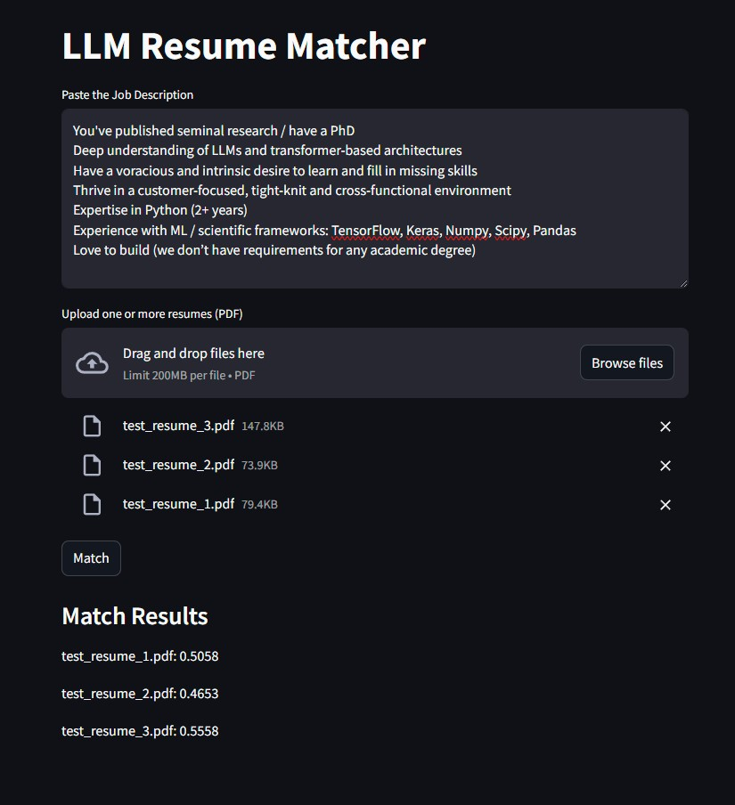

# Resume Screener AI

An LLM-powered resume screening tool that evaluates multiple resumes against a job description using semantic similarity.

---

## 🚀 Features

- Upload **multiple PDF resumes**
- Paste a **job description**
- Get a **match score** for each resume using cosine similarity of embeddings
- Fast, interactive UI built with **Streamlit**
- **FastAPI backend** handles parsing, cleaning, and scoring

---

## 🧠 How It Works

1. **Resumes** are uploaded as PDFs  
2. Each resume is parsed to extract raw text  
3. Text is cleaned using an OpenAI GPT call  
4. The **job description and each cleaned resume** are embedded into vector space  
5. Cosine similarity is calculated to determine a match score  

---

## 🖼️ System Architecture



---

## 🛠️ Tech Stack

- **Frontend**: Streamlit  
- **Backend**: FastAPI  
- **LLM Text Cleaning**: OpenAI  
- **Embeddings**: OpenAI Embeddings / Sentence Transformers  
- **Similarity Metric**: Cosine Similarity (via Scikit-learn)

---

## 🧪 Running Locally

```bash
# Start FastAPI backend
uvicorn main:app --reload

# In a separate terminal, start Streamlit
streamlit run app.py
```

---

## 🧪 Front-end Streamlit UI

Once the app is run locally the Streamlit UI can be accessed through: 

```bash
Local URL: http://localhost:8501
Network URL: http://192.168.x.x:8501
```
The front-end should look like this:



You can generate a match score by:

* Uploading test resumes
* Pasting the relevant JD in the text box
* Clicking 'match'

Ensure the FastAPI backend is running by going to: ```http://localhost:8000/docs``` before engaging the Streamlit front-end
---

## 📁 Project Structure

```bash
.
├── app.py                # Streamlit frontend
├── main.py               # FastAPI backend
├── src/
│   ├── nlp_processing/
│   └── data_processing/
├── Dockerfile
├── requirements.txt
└── README.md
```
---
## Old Implementation 

Used manual feature engineering (e.g. skills overlap, experience matching) to train a CatBoost regressor to predict match score. Still available in ```src/catboost_processing``` 

---

## ✅ To-Do

- Add OpenAI usage tracking  
- Support alternate embedding models (e.g. Cohere, local BERT)  
- Streamlit result download/export option  

---

## 📄 License

MIT
